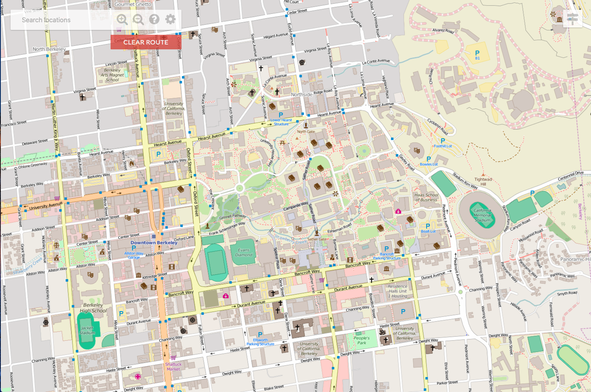

# BearMap

BearMap is a Java Web Application that performs routing and graph traversal to find the shortest path to the destination. One can think of it as a smaller version of the Google Map.

## Getting Started

### Prerequisites

* Java 8
* Spark

### Preview

## Acknowledgment

This is a class project of CS 61BL at UC Berkeley. For more information about the project itself, see [here](https://cs61bl.org/su18/projects/bearmaps/).
